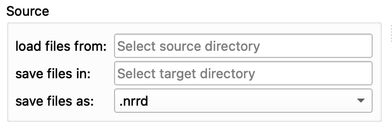

# Tutorial
This chapter describes the parameter settings and functions of the Tooth Analyser in a concise,
step-by-step way. The tutorial is structured to mirror the **Parameters** section in the Slicer UI,
so you can follow the documentation in the same order you see the controls. Each section explains
what the corresponding option does, when to use it, and what to expect from the results.

## Table of contents
- [1. Mode](#1-mode)
  - [1.1 Single Mode](#11-single)
  - [1.2 Batch Mode](#12-batch)
- [2. Segmentation](#2-segmentation)
- [3. Additional](#3-additional)
  - [3.1 Mesh Creation](#31-mesh-creation)
  - [3.2 Medial Surfaces](#32-medial-surfaces)
  - [3.3 Compress](#33-compress)
- [4. Possibilities](#4-possibilities)
  - [4.1 Caries Classification](#41-caries-classification)
  - [4.2 Complex Root Analysis](#42-complex-root-analysis)
- [5. Runtime](#5-runtime)

## 1. Mode
Select how the module should process your data. The mode defines whether you work on the
currently loaded volume or run the same workflow on a folder of images.

### 1.1 Single
Process one dataset loaded in the Slicer scene. Results are written into the current scene and
can be inspected immediately. To show or hide individual segments, use the **Data** module and
toggle the visibility of the generated segmentation and model nodes.

**Input parameters**
- **µCT Image**: The scalar volume to segment. This must be loaded into Slicer first.
- **Apply Segmentation**: Starts the segmentation on the selected image. The progress bar shows
  the current step.

*Figure 1: Input Parameter for the single process*

*Figure 1: Input Parameter for the single process*

### 1.2 Batch
Process a folder of datasets with the same parameters. Batch processing is useful once you have
validated a good parameter configuration on a single case.

**Input parameters**
- **load files from**: Source directory containing the images to process.
- **save files in**: Target directory where results are written.
- **save files as**: Output file type for the generated label maps (`.nrrd`, `.nii`, `.mhd`).
- **Apply Batch**: Starts processing for all files in the source directory. For each input image,
  the module creates a dedicated subfolder and stores the outputs there.

*Figure 3: Input Parameter for the batch process*

*Figure 4: Result batch process*

## 2. Segmentation
Choose the segmentation algorithm to apply. The algorithm performs the actual tissue separation
and produces label maps that represent the main anatomical structures.

- **Segmentation**: Select the desired algorithm. Currently, the available option is
  **Anatomical Segmentation**, which segments the main tooth tissues (e.g., enamel and dentin)
  and creates corresponding label images. The resulting segmentation is placed into the scene and
  can be refined further using standard Slicer workflows if needed.

## 3. Additional
Optional steps that extend or modify the segmentation workflow. These options can be enabled or
disabled depending on the analysis target and required output.

### 3.1 Mesh Creation
- **create mesh**: Generates 3D surface models from the segmentation. This is useful for
  visualization, measurements, and export (e.g., 3D printing). The mesh is created from the label
  images following standard Slicer segmentation-to-model workflows.

### 3.2 Medial Surfaces
- **calculate medial surface**: Computes medial surfaces for dentin and enamel based on the
  segmentation. These surfaces can be overlaid with the original image and are required for
  downstream analyses such as caries classification.

### 3.3 Compress
- **compress**: Downsamples the input image before processing. This can significantly reduce
  runtime on large datasets, but it also reduces accuracy. If you compress multiple times, runtime
  drops further while accuracy decreases with each additional compression. For high-quality results,
  prefer running on a high-resolution image and accept longer processing times.

## 4. Possibilities
These analyses build on the segmentation results and are available as downstream workflows.
They focus on pathology assessment and root-specific evaluation.

### 4.1 Caries Classification
Caries classification is based on the medial surfaces. By overlaying the original data with the
medial surfaces, caries-relevant regions can be analyzed more precisely and compared across cases.

*Figure 5: Usage for the medial surfaces*

### 4.2 Complex Root Analysis
Root analysis enables evaluation of tooth root geometry. The algorithm is designed to work with a
single root and does not require a complete crown.

## 5. Runtime
Runtime depends strongly on your system and the dataset. Large images, medial surface computation,
mesh creation, and batch processing all increase runtime. Use the progress bar to monitor the
current step, and consider **compress** for faster processing when appropriate.
