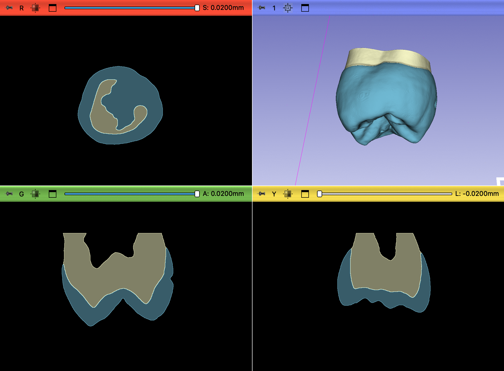
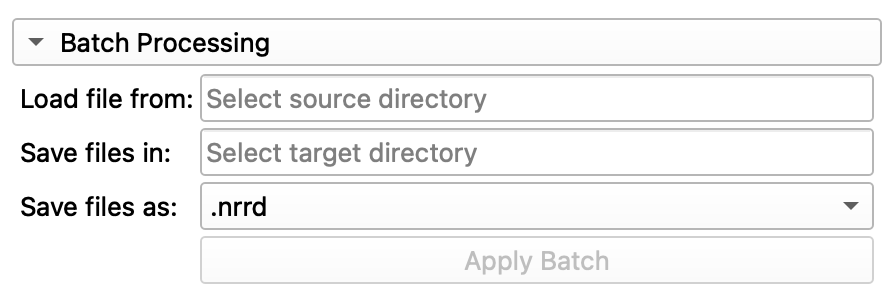

# Tutorial
This chapter describes the parameter settings and functions of the Tooth Analyser.
The extension is organized into several independent steps. The following sections
list all key functions and their results in a structured way.

## Table of contents
- [1. Anatomical Segmentation (Labels)](#1-anatomical-segmentation-labels)
- [2. Mesh Creation](#2-mesh-creation)
- [3. Handle Large Datasets](#3-handle-large-datasets)
- [4. Caries Classification (Medial Surfaces)](#4-caries-classification-medial-surfaces)
- [5. Complex Root Analysis](#5-complex-root-analysis)
- [6. Batch Processing](#6-batch-processing)
- [7. Notes: Processing, Runtime, Limitations](#7-notes-processing-runtime-limitations)

## 1. Anatomical Segmentation (Labels)
Anatomical segmentation is the core of the extension. It segments the microCT image into the main tissues
such as dentin and enamel and creates the corresponding label images. Optionally, medial surfaces can be
computed, which are relevant for later caries classification.

| Description                                                                                                                                                                                                                                                                                                                                                                                                                                                                       | Parameters                                                                                                                             |
|-----------------------------------------------------------------------------------------------------------------------------------------------------------------------------------------------------------------------------------------------------------------------------------------------------------------------------------------------------------------------------------------------------------------------------------------------------------------------------------|----------------------------------------------------------------------------------------------------------------------------------------|
| **Image for Segmentation**: Select the CT volume to segment.   **Segmentation algorithm**: Choose the thresholding method (e.g., Otsu, Renyi).   **Calculate Medial Surface**: Computes medial surfaces for dentin and enamel based on the segmentation.   **Apply Anatomical:** Starts anatomical segmentation. |    *Figure 1: Parameter selection for anatomical segmentation* |

| Description                                                                                                                                    | Result View                                                                                                                   |
|------------------------------------------------------------------------------------------------------------------------------------------------|-------------------------------------------------------------------------------------------------------------------------------|
| Results are immediately visible in the scene. To toggle individual segments, use the Data module (Module: Data).       |    *Figure 2: Result of the anatomical segmentation* |

## 2. Mesh Creation
A 3D mesh can be created from the segmentation. The mesh is generated from the label images and is
relevant for visualization, measurements, and export. Creation follows the standard Slicer workflows
in the **Segment Editor**.

The generated mesh can be sent directly to a 3D printer, allowing you to physically reconstruct and
print the tooth from the mesh.

[Example-Mesh.stl](../Mesh/Example-Mesh.stl)

## 3. Handle Large Datasets
This option reduces resolution (downsampling) so large datasets can be processed faster.
You can run this function by enabling the **Compress** checkbox in the **Preprocessing** section.
With the checkbox enabled, large high-resolution images can be segmented significantly faster,
but this also reduces accuracy.

If you compress an image multiple times, the algorithm becomes faster each time, but accuracy
decreases with every additional compression.

**Recommended workflow:**
If a segmentation requires high resolution, use a very high-resolution image and allow the
algorithm to run longer instead of compressing.

## 4. Caries Classification (Medial Surfaces)
Caries classification is based on medial surfaces. By overlaying the original data with medial surfaces,
relevant regions, especially medial areas, can be analyzed and classified more precisely.

| Description                                                                                                                                                                      | Result View                                                                                                            |
|----------------------------------------------------------------------------------------------------------------------------------------------------------------------------------|------------------------------------------------------------------------------------------------------------------------|
| Medial surfaces of dentin and enamel support identification of caries-relevant regions when overlaid with the original image. |    *Figure 3: Usage for the medial surfaces* |

## 5. Complex Root Analysis
Root analysis enables complex evaluation of tooth root geometry. The algorithm is designed to work
with a single root and does not require a complete crown.

## 6. Batch Processing
With batch processing, tested parameters can be applied to a whole series of CT images.
The Tooth Analyser automatically creates a folder structure in the file system where
results are stored per case. Exactly one *use parameters for batch* checkbox must be enabled.

| Description                                                                                                                                                                                                                                                                                                                                                                                                                        | Parameters                                                                                                                            |
|------------------------------------------------------------------------------------------------------------------------------------------------------------------------------------------------------------------------------------------------------------------------------------------------------------------------------------------------------------------------------------------------------------------------------------|---------------------------------------------------------------------------------------------------------------------------------------|
| **Load file from**: Select the folder containing the CT scans to process.   **Save files in**: Target folder for results.   **Save files as**: Output format for the images.   **Apply Batch:** Starts batch processing. The button is only active when source and target folders are set and exactly one function is selected for batch. |   *Figure 4: Parameter selection for the batch function* |

| Description                                                                                                                                                                                           | Result View                                                                                          |
|-------------------------------------------------------------------------------------------------------------------------------------------------------------------------------------------------------|------------------------------------------------------------------------------------------------------|
| For each image in the batch, a subfolder is created where the segmentation files are stored. |   *Figure 5: Result batch process* |

## 7. Notes: Processing, Runtime, Limitations
When a function is executed, the Tooth Analyzer switches to processing mode. Progress is shown
via progress bar.

Runtime depends strongly on the data, e.g., image size, filtering, and optional computations.

Supported formats include `.ISQ`, `.mhd`, `.nii`, `.nrrd`, and compressed variants such as `.nii.gz`.
