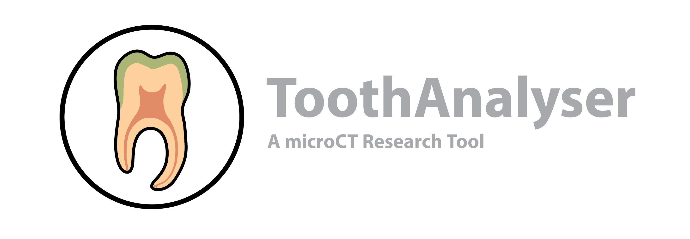
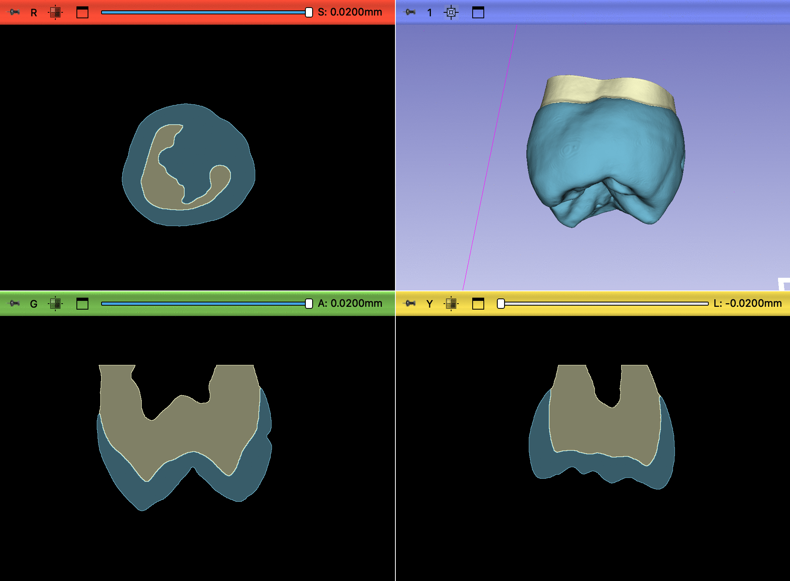

Tooth Analyser is an ongoing development effort for a 3D Slicer extension (SEM) designed for micro-computed tomography (microCT) scans of teeth. It provides specialized preprocessing, segmentation, and analysis features tailored for the analysis of tooth anatomy and pathology.

Developed in collaboration between the *Department of Computer Science* at the Technical University of Augsburg and the *Department of Conservative Dentistry and Periodontology* at LMU Hospital, Munich, Tooth Analyser facilitates advanced dental research through automated and semi-automated workflows.

## Table of contents
- [1. Introduction and purpose](#1-introduction-and-purpose)
- [2. Installation](#2-installation)
- [3. Quick start guide](#3-quick-start-guide)
- [4. Tutorials](#4-tutorials)
- [5. Explanation](#5-explanations)
- [6. Reference Guid (Developers)](#6reference-guid-developers)
- [7. Visualize and save results](#7-visualize-and-save-results)
- [8. Sample Data](#8-sample-data)
- [9. Contributors and Organisation](#9-contributors-and-organisation)

## 1. Introduction and Purpose
MicroCT has become a cornerstone in dental research, offering high-resolution, non-destructive imaging of dental hard tissues such as enamel, dentin, and bone. Unlike conventional radiographic techniques, microCT provides three-dimensional visualization and quantitative analysis at a microscopic level, enabling detailed investigations of both healthy and pathological structures.

One of the primary applications of µCT in dental research is the study of tooth morphology and development. By allowing precise examination of enamel thickness, dentin structure, and root canal anatomy, it contributes to a deeper understanding of tooth formation, variation among species, and forensic dentistry. Additionally, µCT plays a crucial role in the detection and analysis of carious lesions, structural defects, and demineralization patterns, significantly enhancing diagnostic accuracy and preventive strategies. 

However, detailed analysis of microCT scans remains a time-consuming process, and existing tools for automation and standardization are still limited. To address this challenge, we have developed a software backbone designed to integrate various methods, streamlining the analysis and enhancing reproducibility in dental research.

*Figure 1: Full view of the Tooth Analyser extension.*

## 2. Installation
To install the Extension simply follow the steps below in the right order.
1. Download and install a latest stable version of 3D Slicer for our operating system (https://download.slicer.org).
2. Start 3D Slicer application, open the Extension Manager (menu: View / Extension manager)
3. Search for the Extension _ToothAnalyser_ and install it via the _INSTALL_ button

## 3. Quick start guide
To use the Tooth Analyser quickly and correctly, follow the steps below:

- Start 3D Slicer.  
- Load a CT image using the import function of the 3D Slicer core application (Menu: Data). The image does not need to be filtered.  
- Switch to the Tooth Analyser module (Modules: Segmentation/Tooth Analyser).  
- In the _Anatomical Segmentation_ section, select the CT image you want to segment.  
- Check the box _calculate medial surface_ if medial surfaces should be calculated.
- Start the algorithm by clicking the _Apply Anatomical_ button.
- Now the cursor enter waiting mode and a progress bar appears on the bottom.

⚠️ **Notice**: The algorithm, including filtering and medial surface calculation. In the worst case
(large image, medial flattening, filtering), the algorithm can take up to 17 minutes.

## 4. Tutorials
This chapter provides a detailed description of the parameter settings and capabilities of the Tooth Analyser.  
The extension is divided into several functions, each of which has been kept separate. As a result, they can also
be executed independently of one another. This chapter covers all components and explains them in detail.

To start a Tutorial, follow this Link:
[Start a Tutorial](doc/Tutorial.md)

## 5. Explanations
This chapter provides a detailed introduction to the functionality of the various features of the
ToothAnalyzer. The focus is on the procedure itself rather than the technical implementation.
For more details, we refer to the documentation.

[check out the Explanation](doc/Explanation.md)

## 6.Reference Guide (Developers)
This section goes into great detail and provides a technical introduction to the implementation.  
For all developers who want to extend or understand this module, this chapter is particularly relevant.  
For more details, we also refer to the documentation.

[Check out the ReferenceGuide](doc/ReferenceGuide.md)

## 7. Visualize and save results
When the algorithm is finished, the results are automatically loaded into the Slicer scene, so they are immediately accessible.  
However, you can also perform more detailed analyses with this segmentation. Follow these steps:

**Single Process:**
- Open the Data module (Modules: Data)  
- Toggle the desired segments on and off using the hierarchy
- overlap other images
- rename the segmentation
- ...
- Save your results via the menu (Menu: Save)

**Batch process:**
- load the segmentation via the menu (Menu: Data)
- load the created label images as segmentation
- if an 3D model is necessary you can create one via the Segment Editor (Modul: Segment Editor)

 *Figure 2: Result view in the module Data*

## 8. Sample Data
The module includes sample data, primarily used for testing the module.  
However, they can also be used to gain initial experience with the module.  
The sample data ensures that the module can be used by anyone.  

The sample images are micro-CT scans provided as open-source by the  
Poliklinik für Zahnerhaltung und Parodontologie. You can find the sample files
under the assets in the current release.

You can download sample data here: [Download sample data](https://github.com/lukaskonietzka/ToothAnalyserSampleData/releases/download/v1.0.0/P01A-C0005278.nii.gz)

⚠️ **Notice**: The Tooth Analyzer was specifically developed for CT scans  
with tooth structures, which is why other types of CT scans may result in errors. 

## 9. Contributors and Organisation
The development of this extension is a collaboration between LMU Munich and the Faculty of Computer Science at the
Technical University of Augsburg.

- Lukas Konietzka _(THA)_
- Simon Hoffmann _(THA)_
- Dr. med. Elias Walter _(LMU)_
- Prof. Dr. Peter Rösch _(THA)_

