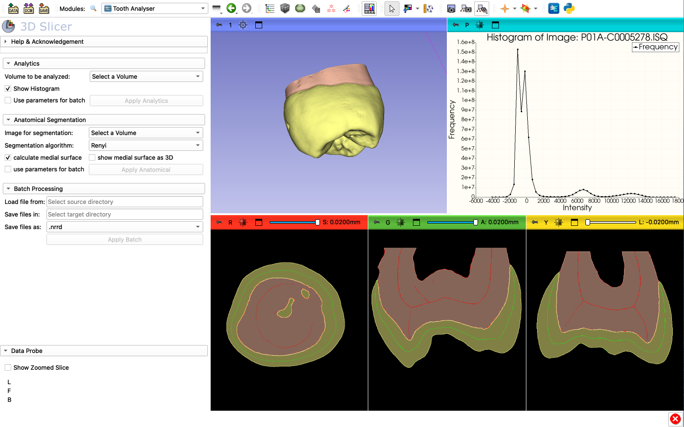
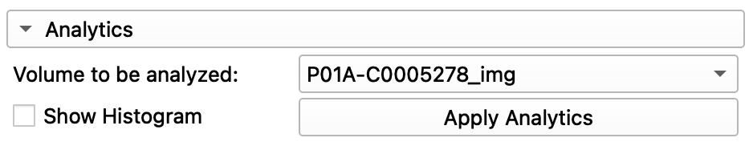
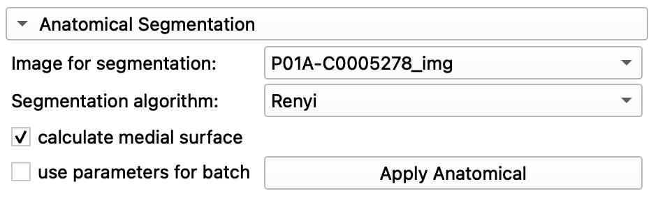
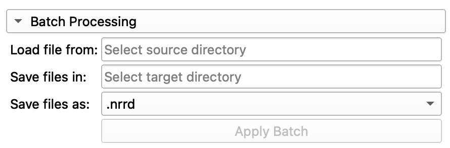
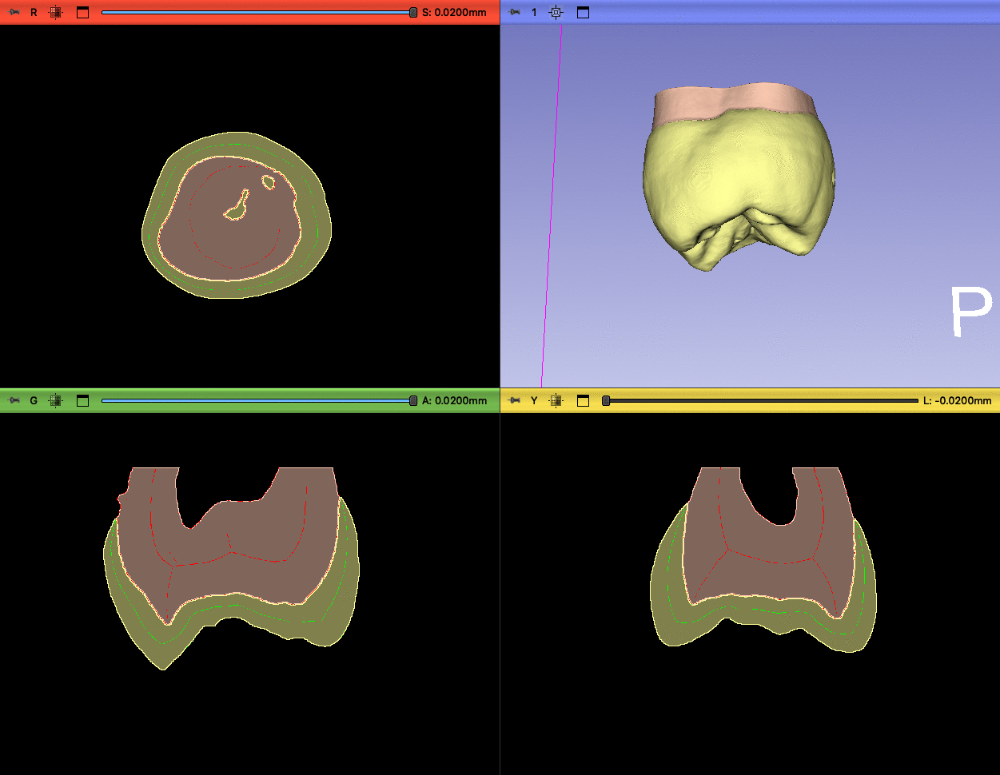

# Tooth Analyser
This 3D Slicer extension (SEM) is designed for dental research. It was developed to support
dental caries research conducted by the Poliklinik für Zahnerhaltung und Parodontologie.
The clinic captures three-dimensional micro-CT images of teeth, which are stored in the Scanio ISQ format.

With this extension, you can directly and unfiltered segment three-dimensional micro-CT scans in *Scanco* ISQ format.

## Tabel of contents
- [1. Introduction and purpose](#introduction-and-purpose)
- [2. Installation](#2-installation)
- [3. Quick start](#2-quick-start)
- [3. Tutorial](#3-tutorial)
  - [3.1. Analytical](#31-analytical)
  - [3.2. Anatomical Segmentation](#32-anatomical-segmentation)
  - [3.3. Batch Processing](#33-batch-processing)
- [5. Contributors and Organisation](#contributors-and-organisation)
- [6. Developers](#developers)
- [7. Acknowledgement](#acknowledgement)

## 1. Introduction and Purpose
As part of a proposal by the Dental Clinic, the goal is to implement an automatic detection of cavities on
micro-CT images in the future using neural networks. Since identifying carious lesions is not trivial, this
extension is designed to assist with the anatomical segmentation of the tooth.

*Figure 1: Full view of the Tooth Analyser extension.*

## 2. Installation
To install the Extension simply follow the steps below in the right order.
1. Download and install a latest stable version of 3D Slicer for our operating system (https://download.slicer.org).
2. Start 3D Slicer application, open the Extension Manager (menu: View / Extension manager)
3. Search for the Extension _ToothAnalyser_ and install it via the _INSTALL_ button

## 2. Quick start
To use the Tooth Analyser quickly and correctly, follow the steps below:

- Start 3D Slicer.  
- Load a CT image using the import function of the 3D Slicer core application (Menu: Data). The image does not need to be filtered.  
- Switch to the Tooth Analyser module (Modules: Segmentation/Tooth Analyser).  
- In the _Anatomical Segmentation_ section, select the CT image you want to segment.  
- Check the box _calculate medial surface_ if medial surfaces should be calculated, and check the box _show 3D_ if the medial surfaces should also be displayed in the 3D model.  
- Start the algorithm by clicking the _Apply Anatomical_ button.

⚠️ **Warning**: The algorithm, including filtering and medial surface calculation, requires approximately 17 minutes to complete.

## 3. Tutorial
This chapter provides a detailed description of the parameter settings and capabilities of the Tooth Analyser.  
The extension is divided into several functions, each of which has been kept separate. As a result, they can also
be executed independently of one another. This chapter covers all components and explains them in detail.

### 3.1. Analytical
With the analytical functions, it is currently possible to create a histogram of the CT scan. This can be very
helpful when selecting a method for anatomical segmentation.

| Beschreibung                                                                                                                                                                                 | Parameter                                                                                                                                    |
|----------------------------------------------------------------------------------------------------------------------------------------------------------------------------------------------|----------------------------------------------------------------------------------------------------------------------------------------------|
| **Volume to be analyzed**: Select the CT scan you want to analyze here.  **Show Histogram**: If this option is selected, a histogram of the previously chosen image will be created. |  *Figure 2: Parameter selection for the analytical function* |

### 3.2. Anatomical Segmentation
The anatomical segmentation is the core of this extension. It allows the automatic segmentation of the
micro-CT image of a tooth into the main dental substances, dentin and enamel. Additionally, medial surfaces can
be generated, which are important for the classification of cavities.

| Beschreibung                                                                                                                                                                                                                                                                                                                                                                                                                 | Parameter                                                                                                                               |
|------------------------------------------------------------------------------------------------------------------------------------------------------------------------------------------------------------------------------------------------------------------------------------------------------------------------------------------------------------------------------------------------------------------------------|-----------------------------------------------------------------------------------------------------------------------------------------|
| **Image for Segmentation**: Select the CT scan you want to segment here.   **Segmentation algorithm**: Choose the algorithm you want to use for segmentation.   **Calculate Medial Surface**: Calculates the medial surfaces of the dentin and enamel based on the segmentation.   **Show Medial Surface As 3D**: If the medial surfaces have been calculated, they can be displayed as a 3D model.  |    *Figure 3: Parameter selection for anatomical segmentation* |

### 3.3. Batch Processing
In batch processing, the tested parameters can then be applied to a whole series of CT images. The Tooth Analyser
will then create a directory in the background where the images will be saved.

| Beschreibung                                                                                                                                                                                                                                                        | Parameter                                                                                                                            |
|---------------------------------------------------------------------------------------------------------------------------------------------------------------------------------------------------------------------------------------------------------------------|--------------------------------------------------------------------------------------------------------------------------------------|
| **Load file from**: Select the folder where the CTs you want to process are located.   **Save files in**: Select the folder where the CTs will be saved after processing.   **Save files as**: Choose the format in which you want to save the CTs. |   *Figure 3: Parameter selection for the batch function* |

## Visualize and save results
When the algorithm is finished, the results are automatically loaded into the Slicer scene, so they are immediately accessible.  
However, you can also perform more detailed analyses with this segmentation. Follow these steps:
- Open the Data module (Modules: Data)  
- Toggle the desired segments on and off using the hierarchy  
- Save your results via the menu (Menu: Save)

*Abbildung 4: Result view in the module Data*

## Contributors and Organisation
The development of this extension is a collaboration between LMU Munich and the Faculty of Computer Science at the
Technical University of Augsburg.

- Lukas Konietzka _(THA)_
- Simon Hoffmann _(THA)_
- Dr. med. Elias Walter _(LMU)_
- Prof. Dr. Peter Rösch _(THA)_

## Developers

## Acknowledgement
This module was developed for the dental caries research of the Dental Clinic at
the LMU in Munich. The development is a collaboration between the LMU and the THA.

