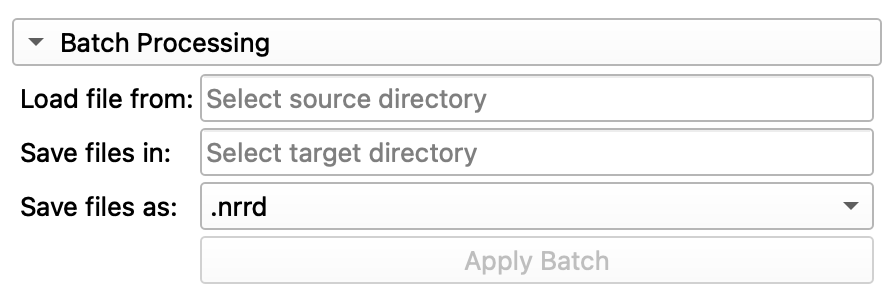

# Tutorial
This chapter provides a detailed description of the parameter settings and capabilities of the Tooth Analyser.

## Table of contents
- [1. Analytical Functions](#1-analytical-functions)
- [2. Anatomical Segmentation](#2-anatomical-segmentation)
- [3. Batch Processing](#3-batch-processing)
- [4. Processing Mode](#4-processing-mode)
- [5. Runtime](#5-runtime)
- [6. Limitations](#6-limitations-)

The extension is divided into several functions, each of which has been kept separate. As a result, they can also
be executed independently of one another. This chapter covers all features and explains them in detail.

## 1. Analytical Functions
With the analytical functions, it is currently possible to create a histogram of the CT scan.
A histogram shows how often different grayscale values appear in the image.  
Additionally, the intensity on the X-axis indicates the image format (8UInt, 16Int, ...).

| Description                                                                                                                                                                                                                                                                                                                                    | Parameters                                                                                                                                  |
|------------------------------------------------------------------------------------------------------------------------------------------------------------------------------------------------------------------------------------------------------------------------------------------------------------------------------------------------|---------------------------------------------------------------------------------------------------------------------------------------------|
| **Volume to be analyzed**: Select the CT scan you want to analyze here.  **Show Histogram**: If this option is selected, a histogram of the previously chosen image will be created.   **Apply Analytics:** This button apply the selected funktion to the selected image. The button is disabled, when no image is available. |  *Figure 1: Parameter selection for the analytical function* |

| Description                                                                                                                                                           | Result View                                                                                                             |
|-----------------------------------------------------------------------------------------------------------------------------------------------------------------------|-------------------------------------------------------------------------------------------------------------------------|
| A histogram shows how often different grayscale values appear in the image. Additionally, the intensity on the X-axis indicates the image format (8UInt, 16Int, ...). This is helpful because the thresholding methods used for anatomical segmentation are based on the image histogram data. Examining the histogram can therefore facilitate the selection of the appropriate method.|  *Figure 2: Resul view ot the created histogram.* |

## 2. Anatomical Segmentation
The anatomical segmentation is the core of this extension. It allows the automatic segmentation of the
micro-CT image of a tooth into the main dental substances, dentin and enamel. Additionally, medial surfaces can
be generated, which are important for the classification of cavities.

| Description                                                                                                                                                                                                                                                                                                                                                                                                                                                                       | Parameters                                                                                                                             |
|-----------------------------------------------------------------------------------------------------------------------------------------------------------------------------------------------------------------------------------------------------------------------------------------------------------------------------------------------------------------------------------------------------------------------------------------------------------------------------------|----------------------------------------------------------------------------------------------------------------------------------------|
| **Image for Segmentation**: Select the CT scan you want to segment here.   **Segmentation algorithm**: Choose the threshold algorithm you want to use for segmentation (Otsu, Renyi).   **Calculate Medial Surface**: Calculates the medial surfaces of the dentin and enamel based on the segmentation.   **Apply Anatomical:** This button apply the anatomical segmentation to the selected image. The button is disabled, when no image is available. |    *Figure 3: Parameter selection for anatomical segmentation* |

After the algorithm has run, the result is immediately visible in the scene. The three views of
the tooth (red, green, yellow) and a 3D model can then be seen.

| Description                                                                                                                                          | Result View                                                                                                                   |
|------------------------------------------------------------------------------------------------------------------------------------------------------|-------------------------------------------------------------------------------------------------------------------------------|
| To toggle individual segments, switch to the Data module (Module: Data) and use the visibility settings to deactivate specific elements. |    *Figure 4: Parameter selection for anatomical segmentation* |

| Description                                                                                                                                                                      | Result View                                                                                                            |
|----------------------------------------------------------------------------------------------------------------------------------------------------------------------------------|------------------------------------------------------------------------------------------------------------------------|
| With the Tooth Analyser you can use the medial surface on the segments dentin and enamel for caries classification, bei overlapping the original image with the medial surfaces. |    *Figure 5: Usage for the medial surfaces* |

## 3. Batch Processing
In batch processing, the tested parameters can then be applied to a whole series of CT images.
The Tooth Analyser
will then create a directory in your file system where the images will be saved. Therefor exactly one checkbox
of the *use parameters for batch* needs to be checked.

| Description                                                                                                                                                                                                                                                                                                                                                                                                                        | Parameters                                                                                                                            |
|------------------------------------------------------------------------------------------------------------------------------------------------------------------------------------------------------------------------------------------------------------------------------------------------------------------------------------------------------------------------------------------------------------------------------------|---------------------------------------------------------------------------------------------------------------------------------------|
| **Load file from**: Select the folder where the CTs you want to process are located.   **Save files in**: Select the folder where the CTs will be saved after processing.   **Save files as**: Choose the format in which you want to save the CTs.   **Apply Batch:** This button apply the selected funktion to a whole series of CT scans. the button is not active if no source and no target directory is specified and if more than one function has been selected for a batch process |   *Figure 6: Parameter selection for the batch function* |

| Description                                                                                                                                                                                           | Result View                                                                                          |
|-------------------------------------------------------------------------------------------------------------------------------------------------------------------------------------------------------|------------------------------------------------------------------------------------------------------|
| The Tooth Analyser creates an folder in your file System where the Segmentation will be stored. For each image in the batch process der will be a subfolder where the segmentation files are located. |   *Figure 7: Result Batch process* |

## 4. Processing Mode
When one of the features is executed, it may take some time for the algorithm to produce a
result. The Tooth Analyzer then switches to Processing mode. This can be recognized by the
progress bar, which appears at the bottom of the widget as soon as a calculation starts.
The current processing step can be identified via the status bar above the progress bar.

## 5. Runtime
The anatomical segmentation is fundamentally a pipeline that combines many small
algorithms. In the worst case, this can result in a runtime of up to 17 minutes. However,
this runtime can be influenced by the following factors:

- Size of the image (8UInt, 16Int)
- Whether filtering of the image is necessary
- Whether additional medial surfaces are calculated
- And more...

## 6. Limitations 
In the Tooth Analyzer, images in any file format can generally be processed.
Some possible file types include:

- .ISQ
- .mhd
- .nii
- .nrrd

Compressed versions of these formats, such as *.nii.gz*, are also supported.

⚠️ **Notice**: all images must currently be in the *16-bit signed integer* format.
If images are in a different format, the algorithm will still perform a segmentation,
but the result will be incorrect and unusable.
